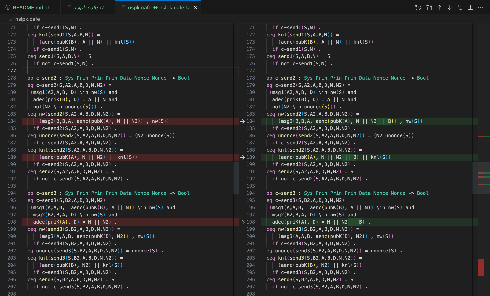

## The formal specification of NSPK protocol and a counterexample of its secrecy property

`nspk.cafe` contains the specification of the NSPK protocol. The only difference between `nspk.cafe` and `nslpk.cafe` is indicated in the following figure:



where `nspk.cafe` is on the left and `nslpk.cafe` is on the right. 

We define the `keySe` predicate in module `PRED` at the end of the file:
```  
  op keySe : Sys Prin Prin Prin Nonce Nonce Data Data -> Bool
  eq keySe(S,A2,A,B,N,N2,D,D2) = 
  (not(A = intru or B = intru) and
    msg1(A2,A,B, D) \in nw(S) and 
    adec(priK(B), D) = A || N and 
    msg2(B,B,A, aenc(pubK(A), N || N2)) \in nw(S) and 
    msg3(A2,A,B, D2) \in nw(S) and 
    adec(priK(B), D2) = N2)
   implies not(N2 \in knl(S)) .
```

The predicate specifies the nonce secrecy property from the responder point of view, which is widely known as a wrong property. A counterexample is given in the `ctx.cafe` file.

This is mainly to show that we correctly specify NSPK as well as NSLPK.